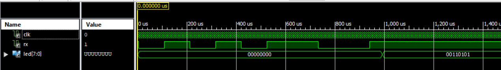

# UART-interface-between-FPGA-and-AVR

This is a simple project in which a main goal was to implement UART interface on uC and FPGA.

Repository consists program files, testbench and photos of wired circuit.
As an uC has been used Atmega 8A and as a FPGA chip Spartan-6 XC6SLX9.

Microcontroller acts as a master which counts number of button presses and sends that number 
throught UART interface to the slave FPGA board which shows that number on LEDs as a binary code.

Wired circuit used for tests:

Simulation for the FPGA part:

